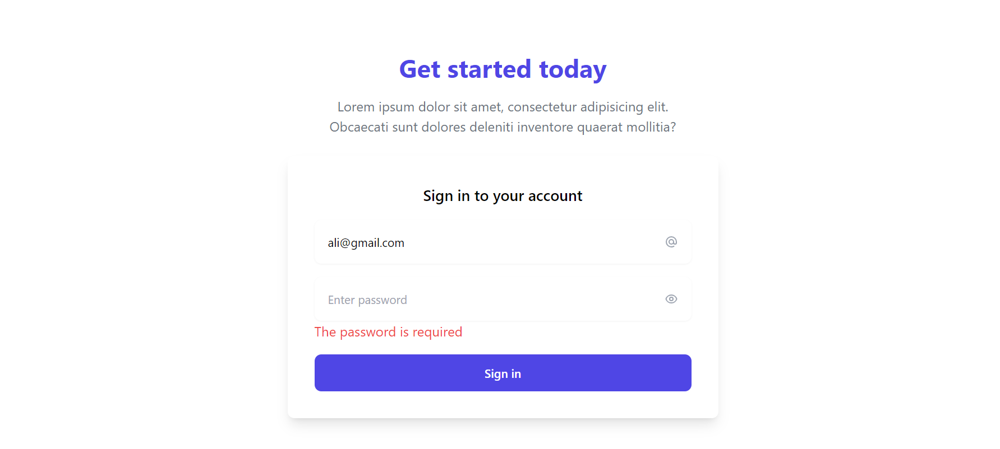
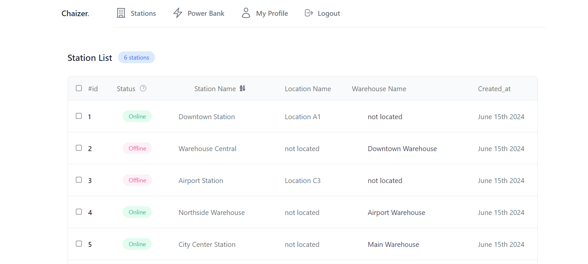
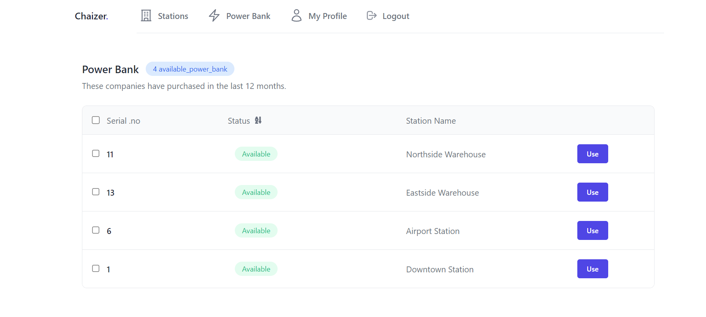
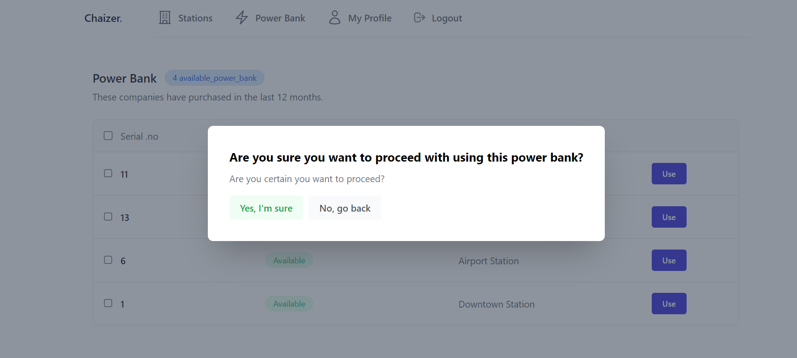
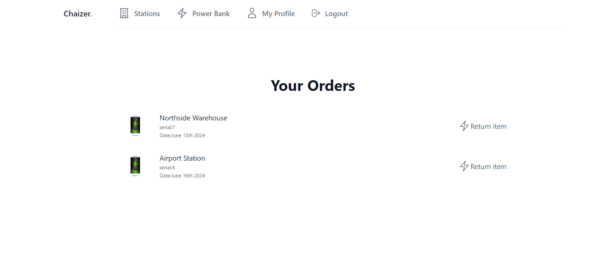
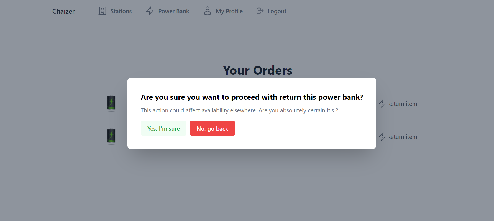
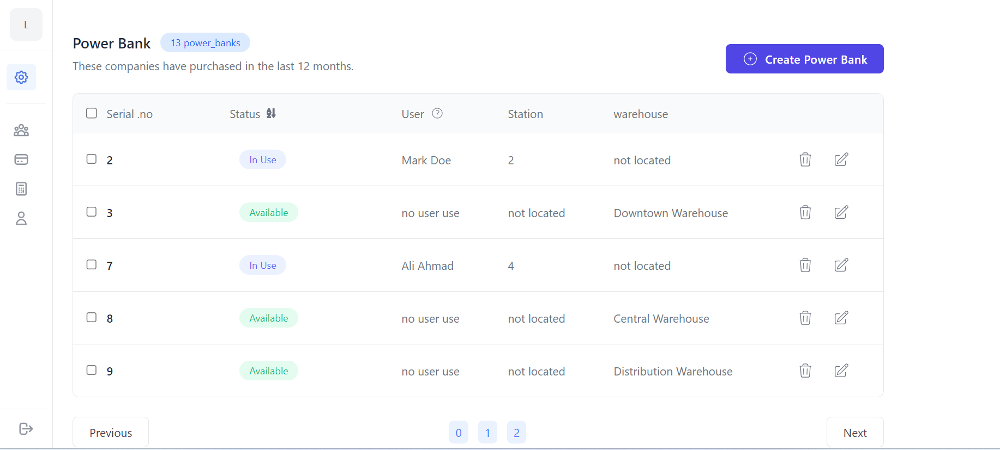
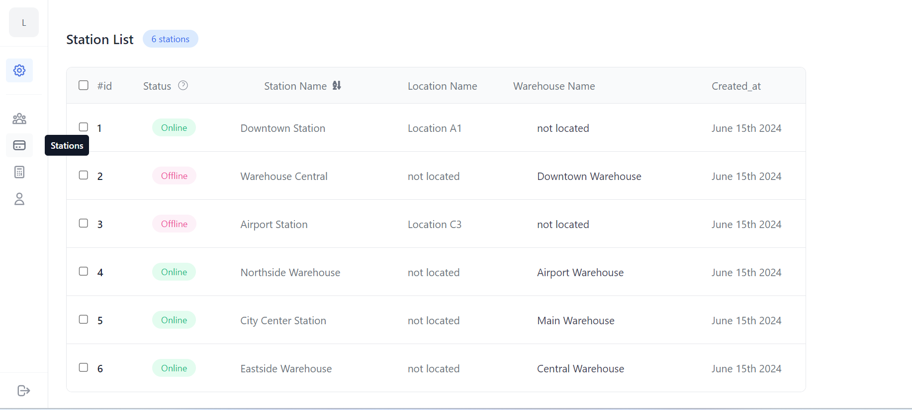
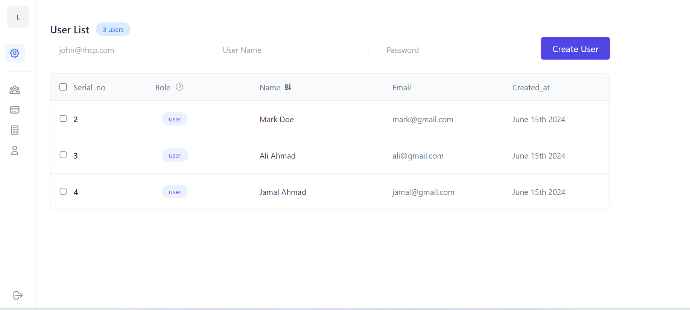

# ⚡ Power Bank Management System

## 📝 Description

This project provides a backend API built with Ruby on Rails for managing Power Banks across locations, stations, and warehouses. It includes CRUD operations for Power Banks, Stations, Locations, and Warehouses, along with user role management. Additionally, it features a frontend built with React and styled using Tailwind CSS, and bootstrapped with Vite for faster development and build processes.

## 🛠️ Installation

### Backend (Rails API)

To set up the backend API locally, follow these steps:

1. 📂 Clone the repository:
   ```bash
   git clone https://github.com/WalaaRababa/PowerBankManagement
   cd  PowerBankManagement
   ```

2. 📦 Install dependencies:
  ```bash
  bundle install
   ```
3. 🗄️ Set up the database:
   ```bash
   rails db:create
   rails db:migrate
   rails db:seed
   ```
4. 🚀 Start the Rails server:
```bash
rails server
   ```
### Frontend (React with Tailwind CSS )

To set up the frontend locally, follow these steps:
1. 📂 Navigate to the frontend directory:
   ```bash
   cd  PowerBankManagement/forntend-app
   ```
2. 📦 Install dependencies:
   ```bash
       npm install
   ```
3. 🌐  Start the Vite development server:
   ```bash
      npm run dev
   ```
## 🚀 Usage

### 🛡️ Admin User

Admin users have the following capabilities:

- ➕ Create, read, update, and delete warehouses, stations, users, and power banks.
- 🔄 Assign power banks to stations, warehouses, or users.

### 👥 Normal User

Normal users have the following capabilities:

- 📜 View lists of locations and stations.
- 🔋 View available power banks in stations.
- 👛 Take a power bank from a station and return it.

## 📸 Screenshots
### 🌐 Login


*Login page for users & admin to access the system.*

### 📊 User Dashboard


  *Overview of the user dashboard.*


*Available power banks in a stations.*

*Use power banks from a stations.*

*User power banks for logged user.*

*Return power banks to a station.*
### 🔧 Admin Panel


*Overview of the admin panel.*


*Managing stations in the admin panel.*


*Managing users in the admin panel.*


*Managing power banks in the admin panel.*